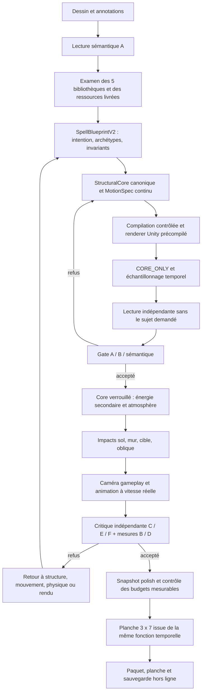

# D20 — Spell Pipeline V2

Extension de construction ultérieure : [D21 — UNITY GOD](D21_UNITY_GOD.md), méthodes sources vérifiées et reçus liés aux plans. Les preuves D20 ci-dessous restent celles de la livraison initiale.

**Actualisation du 25 septembre à 10:13 Paris : D21 est installé avec le renderer 1.8.0.** L'attente UAC ci-dessous est historique et levée par la demande de déploiement. Utiliser [le point de reprise actuel](NEXT_ACTIONS.md) et [la preuve d'installation](../evidence/public/backend/unity-god-d21-installation.json), sans rejouer la procédure D20.

## État de travail

Code V2, backend D20 et Player 1.8.0 construits et empaquetés le 25 septembre 2026. **Installation en attente de validation Windows UAC** : le premier lancement opérateur a été annulé par Windows, sans appel modèle. Le runtime D19 et sa fenêtre existante sont conservés. [Preuve de livraison](../evidence/public/backend/blueprint-v2-d20.json) · [Liste des fichiers](V2_FILES_CHANGED.md).

## Diagnostic de V1

- `JobProcessor.cs` figeait la description, demandait G avant la géométrie et B, puis rapprochait une liste de pièces de l'image. Il n'existait pas de représentation canonique partagée avant la planche.
- `SpellVisualConstruction.parts` et `ImageConstructedSpellVisual` rendaient des meshes indépendants. Leurs poses et mouvements pouvaient évoquer un objet sans imposer sa continuité structurelle.
- `RefineVisualsAsync` corrigeait essentiellement les décorations et surfaces. Sa politique finale pouvait livrer le meilleur candidat malgré un écart artistique ; cela ne constitue pas une validation de silhouette.
- `SpellVisualCaptureRunner` V1 annonçait honnêtement une présentation décorative. Elle ne démontrait pas les contacts gameplay sol/mur/cible/oblique.

Ces parcours restent accessibles aux admissions historiques. Leurs assets, shaders et paquets sont conservés.

## Routage et compatibilité

Le nom produit **V1** recouvre les versions d'admission DB 0, 1, 2, 3 et 4. **V2** utilise `visual_pipeline_version=5`. Migration012 modifie le défaut des *futures insertions* ; elle ne met à jour aucun job existant.

Un plan V2 porte `SpellNode.blueprint_v2.schema_version = sp.blueprint/2.0`, `geometry_id = canonical.v2`, aucune construction ancienne et aucun mélange de nœuds V1/V2. Le client requis est 1.8.0. L'enveloppe `sp.plan/1.0`/`sp.compiled/1.0` reste versionnée par ce discriminateur, avec des schémas de validation séparés. Les champs nuls ajoutés ne changent pas la sérialisation des paquets V1.

Les providers n'ont aucun accès aux sources Unity ni commande de build. Le worker appelle `codex exec` isolé, reçoit des données, valide le schéma, puis lance un renderer précompilé, épinglé par manifeste SHA et protégé par ACL. Les téléchargements et imports appartiennent au développement. Aucun blueprint ne contient de C#, shader source, URL exécutable ou chemin libre.

## Source commune : SpellBlueprintV2

| Section | Rôle |
|---|---|
| `intent` | Sujet, action, cible, matière perçue, caractère du mouvement, silhouette prioritaire, rôle, impact et disparition |
| `archetype` | Une ou plusieurs familles parmi créature, projectile, rayon, flux, orbital, zone, explosion, invocation, bouclier, portail, environnement, multi projectile, abstrait |
| `identity` | Invariants hard/soft/free, topologie fixe, repères suivis, palette, nombre d'entités, coordonnées locales cm/+Y haut/+Z avant |
| `structural_core` | Type de représentation, points canoniques, rayons/largeurs, branches, résolution et dimensions bornées |
| `motion` et `phases` | Fonction continue : trajectoire, déformation, oscillation, accélération, anticipation, suivi, apparition/activité/disparition |
| `rendering_layers` | Matière du core, énergie secondaire, atmosphère et ressources réellement embarquées |
| `physics` | Propriétaire racine, stratégie de collision, réponse explicite, durée ; aucune physique décorative |
| `impact` et `disappearance` | Pose de contact, flash, déformation, survie du core, émission, direction, dissolution/fin |
| `unity_implementation` | Composants du moteur autorisés, renderer, déformation, shader, particules, audio, collisions et durée |
| `validation_rules` | Gates obligatoires et budgets de sommets, particules, appels de rendu, matériaux, CPU/GPU/overdraw |

Voir les contrats C# et `contracts/spell-blueprint-v2.schema.json`. Les contraintes JSON strictes sont complétées par validation sémantique ; Unity partage un contrôle d'allocation avant de construire un mesh.

## Choix structurels

| Core | Utilisation |
|---|---|
| `swept_tube` | Corps allongé ou flux continu, section le long d'un chemin ; pas de capsules juxtaposées |
| `branched_surface` | Sujet avec ramifications connectées ; surface fusionnée, topologie conservée lors du mouvement |
| `ribbon` | Flux plat, lame ou ruban, coordonnées longitudinales continues |
| `beam` | Rayon dont largeur et longueur sont contrôlées |
| `radial_volume` | Masse unique de projectile ou expansion d'explosion |
| `vortex_surface` | Colonne tourbillonnante, profil radial continu et rotation réelle |
| `planar_field` | Surface/glyphe, zone, portail ou bouclier plan |
| `controlled_swarm` | Plusieurs éléments intentionnels suivant un modèle collectif, nombre stable |

La compatibilité archétype/core est contrôlée par le compilateur. Le moteur refuse un type non pris en charge au lieu de substituer une sphère. Ces huit représentations sont une grammaire contrôlée, pas la promesse qu'un mesh artistique arbitraire est reconstructible sans ressources supplémentaires. Un sujet qui échoue au contrôle sémantique ne doit pas être publié.

## Gates et preuves

| Gate | Preuve attendue |
|---|---|
| A — structure | Captures opaques CORE_ONLY ; critique indépendante sur silhouette, proportions, orientation et primitives visibles |
| B — continuité | Identité/topologie et positions suivies entre instants ; critique de la cohérence visuelle |
| C — rendu | Comparaison core et rendu final ; les couches secondaires ne masquent pas le sujet |
| D — impact | Scénarios Unity sol/mur/cible/oblique avec le runtime réel, réaction contrôlée et absence de physique décorative |
| E — caméra | Capture depuis la caméra gameplay à distance réelle |
| F — mouvement | Séquence réellement avancée à vitesse normale, temps observés et planche temporelle ; une capture isolée ne suffit pas |
| Sémantique | Première lecture sans description ; seconde comparaison de cette lecture avec l'intention |
| Performance | Comptages et temps effectivement observés ; toute mesure indisponible est marquée inconnue avec raison |

`completed=true` dans une capture veut dire que le renderer a fini son travail. Ce champ ne vaut pas acceptation artistique. Les statuts `technical_pass` et `requires_visual_review` restent distincts. Un critique ne peut remplacer une mesure physique manquante.

## Passes, reprise et refus

La table append-only `spell_v2_passes` conserve recherche, blueprint, core, lecture aveugle, structure, mouvement, secondary, impact, polish, optimization, verdict et planche. Chaque document est lié au SHA du plan et au SHA du core verrouillé. La dernière acceptation du verdict n'intervient qu'après combinaison de la critique et des mesures du moteur. Les images de capture privées sont relues et vérifiées par SHA à la reprise.

Les corrections portent sur la première étape responsable. La structure ne peut être changée pendant une retouche du rendu. Les corrections sont bornées à quatre candidats par admission pour ne pas consommer indéfiniment le compte ; cela ne réintroduit pas un quota quotidien de parchemins. Si aucun candidat ne passe, le dessin et les étapes restent conservés, et aucun sort refusé n'est présenté comme terminé.

Le Player conserve la planche canonique sous `binary_assets/v2-animation-sheet.png` avec ID d'artefact et SHA. La sauvegarde hors ligne comprend le blueprint et les ressources de données nécessaires ; le renderer est livré avec le jeu.

## V1 / V2

| | V1 historique | V2 nouveaux sorts |
|---|---|---|
| Autorité de forme | Construction depuis description et images | Blueprint canonique avant rendu |
| Planche | Atlas imagé puis composition | Échantillons de la fonction continue Unity |
| Core | Pièces visuelles | Représentation choisie selon l'archétype |
| Décoration | Mélangée à la construction | Couches distinctes après gate core |
| Physique | Gameplay existant ; capture décorative | Gameplay conservé + contrat explicite et scénarios de contact |
| Refus visuel | Meilleur candidat parfois livré | Publication bloquée tant que les gates obligatoires échouent |
| Historique | Immuable | Nouveaux jobs seulement |

## Tests et acceptation

Le sort `examples/v2-validation` est une fixture de développement séparée, pas une génération joueur ni un appel modèle. Le cache de capture `.runtime/v2-fixture-cache` est isolé de la bibliothèque du propriétaire. Ne pas confondre sa compilation avec un essai réel de Codex : les preuves indiquent explicitement les appels effectivement exécutés.

L'acceptation humaine et la qualité de tous les futurs dessins ne peuvent pas être déduites d'un seul cas. Les contrôles sont appliqués à chaque nouveau sort ; les rapports de livraison doivent indiquer les cas exécutés et les mesures absentes.

## Résultats réellement obtenus

| Vérification | Résultat |
|---|---|
| Contrats et compilation V2 | **27 contrôles réussis** : allocations bornées, cohérence physique, compatibilité V1/V2, cycles exacts |
| Compatibilité V1 | Suite existante : **141 recettes / 705 paires de porteurs** ; champ V2 absent de la sérialisation V1 |
| Assets historiques | **172 fichiers inchangés dans Git** après le build final ; aucun paquet joueur modifié |
| Unity | **Success, sortie 0**, Unity 6000.3.24f1 / URP / IL2CPP, aucune erreur de shader |
| Backend | Publication API, Worker et diagnostics : **sortie 0** |
| Continuité Unity | 121 échantillons déterministes du même core, topologie constante |
| Boucle active | Variante numérique : 4,5 s, 9 pulsations, 2147 sommets ; écart de fermeture **0 m**, tolérance 1 mm |
| Contacts réels | Sol, mur, cible, oblique : **un contact chacun**, topologie préservée |
| Caméra et mouvement | Vrai lancer, ticks 50 Hz cadencés, images horodatées et vidéo |
| Qualité visuelle | **Non acceptée par la revue indépendante** : silhouette continue, matière et impact trop faibles |
| Nouveau parcours Codex V2 | **Non exécuté**, élévation Windows annulée |
| Installation D20 / DB | **Non exécutée** ; migration 012 et publication transactionnelle restent à exercer sur le service |
| Acceptation humaine | **Non obtenue** |

[Résultats machine](../evidence/public/v2/results.json) · [Revue indépendante](../evidence/public/v2/full-visual-review.md) · [Vidéo](../evidence/public/v2/fixture/motion-real-time.mp4) · [Planche](../evidence/public/v2/fixture/normal_sheet.png).

La vidéo reprend les images capturées avec leurs intervalles observés, sans son ; son muxage peut quantifier les timestamps à 40 ms. Les 68,40 requêtes de rendu/s du manifeste final concernent la capture URP 512 × 512, pas le FPS interactif du jeu. Temps GPU, overdraw et draw calls GPU exacts restent inconnus.

Une première variante numérique a été refusée parce qu'elle ajoutait une rotation absente de la physique figée ; la fixture a été corrigée, sans relâcher le contrôle. Le banc magenta initial a été corrigé avec des matériaux privés et l'effacement de la cible de rendu. Aucun matériau historique n'a été édité. La correction du banc ne change pas le refus artistique de la fixture.

## Reprise de l'installation

Player préparé : `game/Build/WindowsBlueprintV2Playable/Palimpseste.exe`, avec toutes ses dépendances. L'ancienne fenêtre et son raccourci restent en place avant la bascule du service.

1. Recevoir la réponse à la demande UAC en attente ; ne pas considérer le silence comme une autorisation de relancer la fenêtre annulée.
2. Exécuter `ops/test-blueprint-v2-service.ps1` avec le stage publié et ce Player sous élévation Windows. Son rapport distingue les vrais appels B/J ; aucune écriture DB ni bibliothèque joueur.
3. Corriger toute erreur réelle du nouveau contrat fournisseur avant d'annoncer un parcours Codex V2 complet.
4. Installer avec `ops/deploy-lifecycle.ps1 -BackendRevision D20 -ClientVersion 1.8.0 -JobConcurrency 0 -DrainExistingJobs`, le stage indiqué par la preuve backend et `-PlayerRoot` sur WindowsBlueprintV2Playable. Le script attend les travaux existants et applique uniquement 012, après vérification de 011.
5. Après succès attesté, actualiser le raccourci, relancer le Player 1.8.0 et laisser le créateur juger de nouveaux parchemins. Ne pas convertir les anciens.
