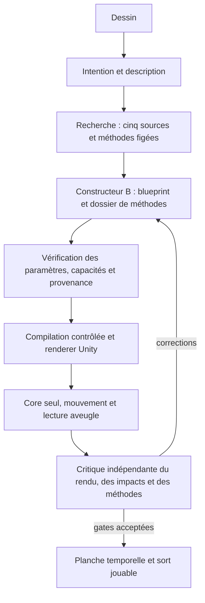

# D21 — UNITY GOD dans la construction V2

## Objectif

Construire les futurs sorts en comprenant les méthodes des bibliothèques : représentation, coordonnées, fonctions temporelles, matière, émissions, contact et extinction. Le skill fournit des connaissances documentées et une méthode de travail ; aucun poids de modèle n'est réentraîné.

Le [skill versionné](../skills/unity-god/SKILL.md) sert au développement Unity. Une version de ses instructions, limitée aux capacités du moteur précompilé, accompagne chaque nouvelle recherche V2. Le worker joueur ne reçoit aucun outil de téléchargement, d'importation, de modification de code ou de build.

## Sources réellement étudiées

Les cinq bibliothèques imposées sont examinées. **20 fiches de méthodes** proviennent de **22 fichiers réels vérifiés par SHA**, dans quatre dépôts ; Magic Effects FREE conserve sa fiche de disponibilité, car son package n'est pas acquis. Les pointeurs LFS incomplets ne comptent pas comme des graphes lus. [Preuve d'inspection](../evidence/public/unity-god/source-inspection.json) · [Catalogue détaillé](../skills/unity-god/references/methods.json).

Chaque méthode conserve source, commit, fichier, empreinte, fonctionnement observé, adaptation possible, limites et contrôles disponibles. Les principes étudiés chez xtaja sont décrits sans copier son code non licencié. Les sources Unity Companion restent des références de conception ; leurs graphes ne sont pas annoncés comme importés.

**Sept méthodes sont sélectionnables dans le Player V2 actuel** :

| Méthode source | Adaptation réellement disponible |
| --- | --- |
| TinyPlay — plasma | Deux couches de texture RGB en flux opposés, bordure lumineuse |
| TinyPlay — champ de force | Fresnel et bruit de surface ; pas d'intersection par profondeur |
| Keijiro — domaine sans divergence | Modulation des filaments spectraux ; pas d'advection de particules |
| Keijiro — rotation locale | Principe adapté à la rotation continue du core canonique |
| xtaja — horloges indépendantes | Mouvement continu séparé des enveloppes d'apparition/extinction |
| xtaja — dissolution liée à la vie | Dissolution longitudinale déjà implémentée, pas le shader original |
| Unity Bonfire — populations séparées | Core plasma et population atmosphérique de fumée distincte |

Les treize autres fiches servent au développement de capacités futures. Elles ne peuvent pas être déclarées exécutées dans un plan. Ce catalogue n'est pas la liste exhaustive des contrôles du blueprint : pulsation, déformation, trajectoire et impact restent décrits dans les contrats V2.

## Boucle effective

En V2, la planche est échantillonnée depuis le même core et son mouvement continu. Elle ne génère pas sept géométries indépendantes. Les passes approuvées restent verrouillées.

### Ce que B doit fournir

Le prompt `sp.prompt.blueprint/2.1` renvoie une enveloppe privée `sp.unity-god-build/1.0` :

- `plan` : contrat V2 existant, sans changement du format consommé par Unity ;
- `method_design.source_review` : les cinq sources, usage ou raison de non-usage ;
- `method_design.nodes` : une à quatre méthodes pertinentes par nœud, adaptation, innovation, résultat attendu et liens vers les valeurs réelles du blueprint ;
- empreintes du skill et du catalogue figés dans la recherche.

Le serveur exige des méthodes existantes, sélectionnables, utilisées selon leur portée et leurs droits de réutilisation. Chaque lien `/blueprint_v2/...` doit désigner une valeur scalaire identique dans le plan. Les conditions d'application du catalogue doivent toutes être satisfaites. Citer « TinyPlay » ou déclarer un shader absent ne suffit plus.

### Persistance et critique

Le serveur produit un reçu `sp.unity-god-receipt/1.0`, lié aux SHA du plan et de la recherche, avec les fiches retenues. Plan et reçu sont enregistrés dans la même transaction. Chaque reprise vérifie à nouveau le reçu avant capture. La publication des plans B 2.1 exige un reçu pour cette même révision.

La critique visuelle non aveugle reçoit le dossier vérifié et compare l'adaptation annoncée au rendu. En `CORE_ONLY`, elle tient compte des surfaces et particules volontairement désactivées. La lecture sémantique aveugle ne reçoit ni description ni méthodes. Un reçu valide prouve la cohérence des données ; il ne prouve pas la qualité artistique.

**Aucun appel Codex supplémentaire n'est ajouté** : les appels B et J existants reçoivent davantage de contexte. Le volume de contexte augmente ; aucun gain de latence ni coût mesuré n'est revendiqué.

## Compatibilité et installation

Skill installé dans `C:/Users/Utilisateur/.codex/skills/unity-god`, cinq fichiers vérifiés contre le dépôt ; validation de structure réussie. Backend D21 compilé et empaqueté avec sortie 0. [Installation locale](../evidence/public/unity-god/skill-installation.json) · [Publication](../evidence/public/backend/unity-god-d21.json).

- V1 conserve son parcours. Aucun asset, shader, prefab ou sort historique n'est modifié par D21.
- Un dossier V2 déjà figé sans `unity_god` conserve B 2.0.
- Les nouvelles recherches V2 utilisent le skill 1.0 et B 2.1.
- Migration 013 ajoute la passe `methods`, sans mettre à jour les jobs existants. Le déploiement V2 a appliqué 012 puis 013 avant le redémarrage.
- Le backend distribue seulement les trois fichiers de données nécessaires du skill ; aucun clone de bibliothèque ou outil de développement n'entre dans le worker.
- Player 1.8.0 D20 réutilisé, sans nouveau build Unity.

**Backend D21 installé le 25 septembre 2026 à 10:13:20 Paris (08:13:20 UTC)** après la demande « déploie » : `completed=true`, `services_started`, migrations 012 et 013 appliquées, `claims_paused=false`, concurrence applicative `0` (aucun plafond de jobs). L'attente de validation Windows précédente est levée. [Installation réelle](../evidence/public/backend/unity-god-d21-installation.json).

À 10:15 Paris, `GET /health/ready` a répondu **HTTP 200 `ready`**. Les processus API `13976` et worker `18000` étaient vivants à 10:16:14 Paris. L'ouverture du Player, la mise à jour du raccourci et la création d'une preuve d'ouverture étaient regroupées dans une commande refusée avant exécution par le contrôle automatique (`blocked by policy`, sans motif détaillé). Aucune de ces actions effectuée ; aucun contournement. Le créateur peut ouvrir directement `E:/Palimpseste/Palimpseste_GitHub/game/Build/WindowsBlueprintV2Playable/Palimpseste.exe`. [Disponibilité observée](../evidence/public/backend/unity-god-d21-availability.json).

Le ZIP backend reste l'instantané de publication avant déploiement ; il n'a pas été reconditionné pour ajouter cette preuve. L'état installé est attesté par le rapport séparé dans le dépôt.

## Vérifications et limites

Quatorze contrôles déterministes vérifient bindings, droits d'adaptation, références absentes, changement de plan et falsification du reçu : [résultats](../evidence/public/unity-god/contract-tests.json). Ils ne simulent pas un appel modèle et ne prétendent pas valider visuellement un sort.

La validation de structure du skill et une lecture indépendante de sa méthode complètent ces contrôles. La lecture indépendante reste une proposition sur documents, pas un résultat de génération joueur. Les preuves finales d'installation locale et de publication sont regroupées dans [la livraison D21](../evidence/public/backend/unity-god-d21.json).

Pour ce déploiement D21 : migrations 012 et 013 et contrôle de santé HTTP réellement exécutés ; aucun appel fournisseur de diagnostic, aucune génération joueur, aucun test de gameplay et aucune capture Unity lancés par l'agent. L'essai complet de B 2.1 et l'acceptation artistique restent ouverts. Les résultats Unity D20 sont historiques et distincts ; sa fixture n'a pas été acceptée artistiquement.

## Point de reprise

1. Le backend D21 est installé ; ne pas rejouer les migrations pour commencer l'essai.
2. Le créateur ouvre directement le Player 1.8.0 ci-dessus, puisque l'ouverture et la mise à jour du raccourci n'ont pas été exécutées.
3. Laisser le créateur essayer un nouveau parchemin, puis utiliser sa critique pour enrichir le moteur et les fiches sans modifier les sorts historiques.
4. Consigner séparément la connexion réelle du Player, le parcours complet de B 2.1 et l'acceptation artistique ; la santé API n'en est pas une preuve.
